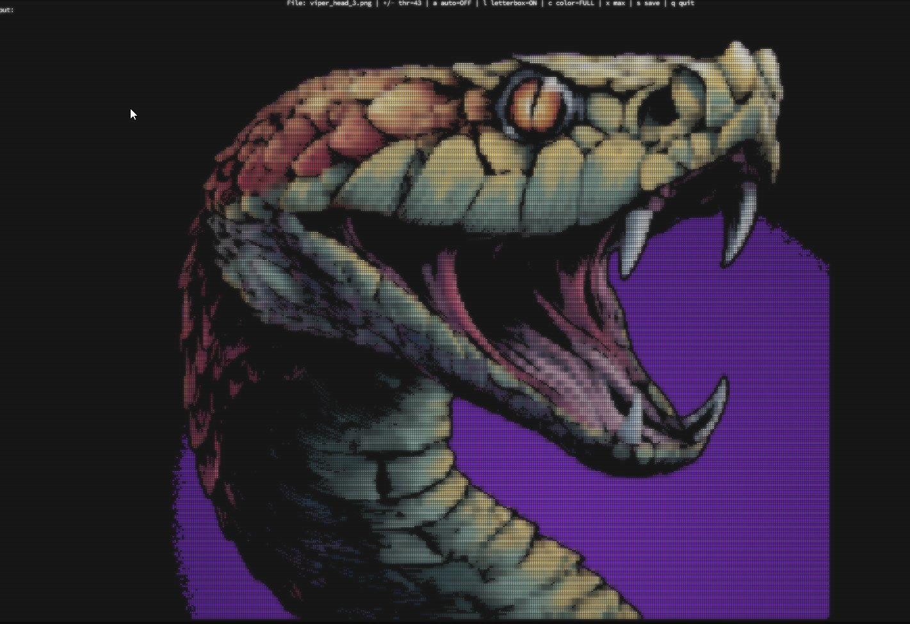
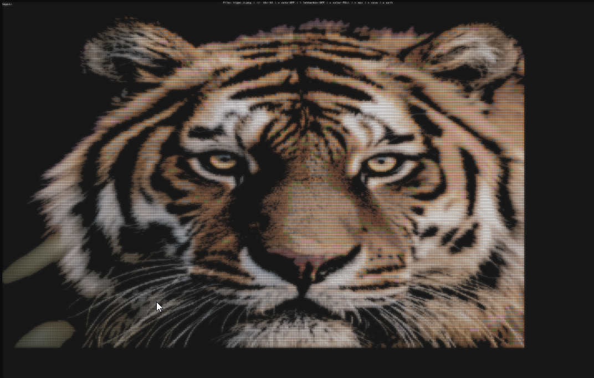
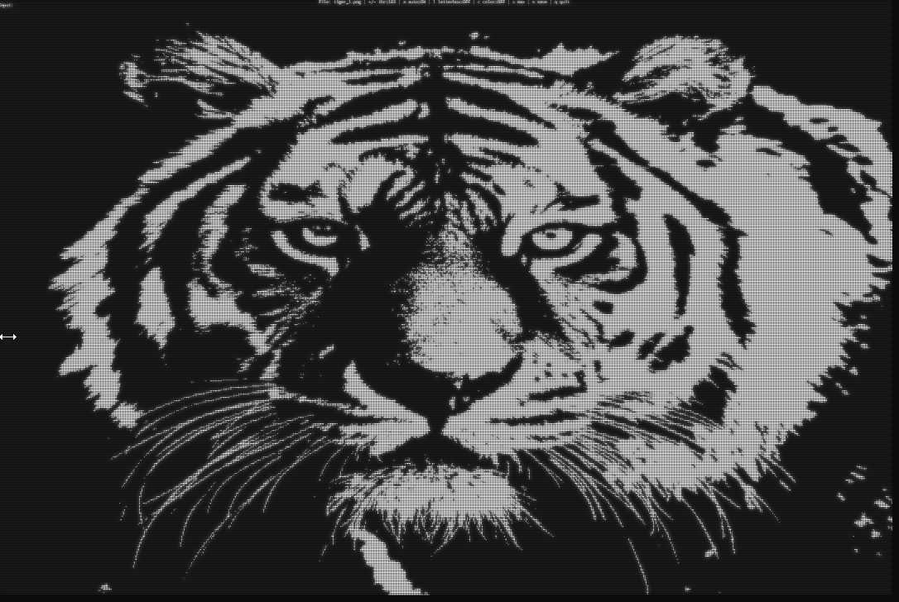
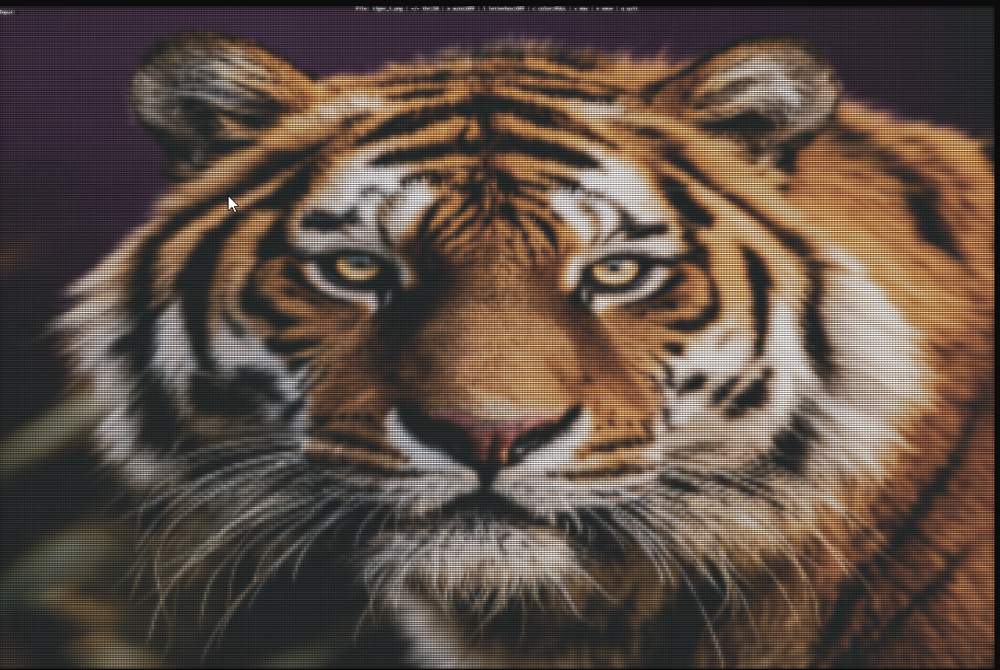
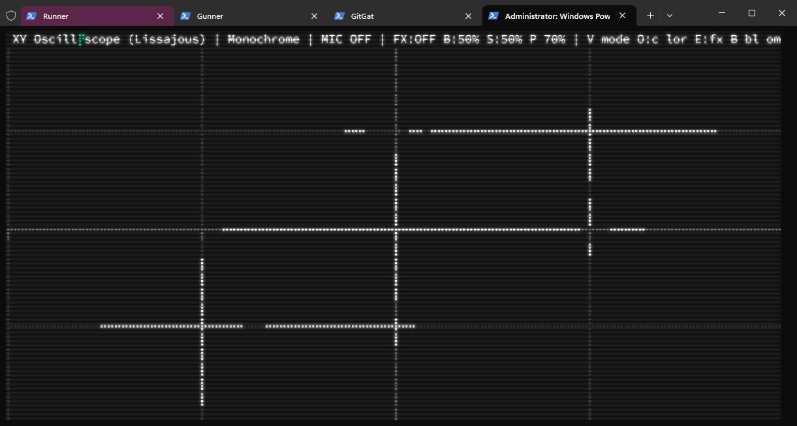
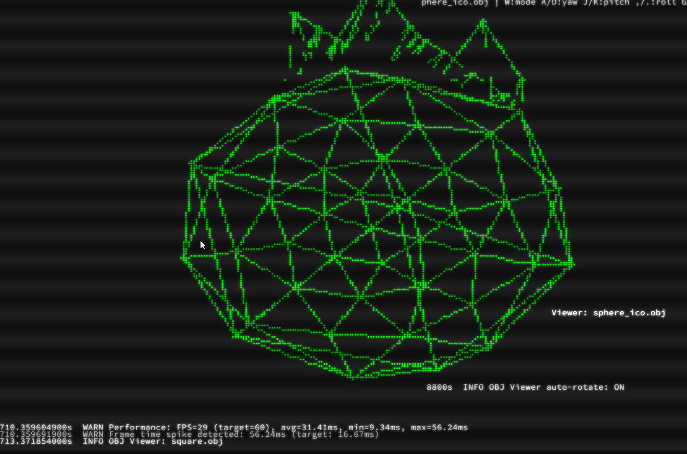
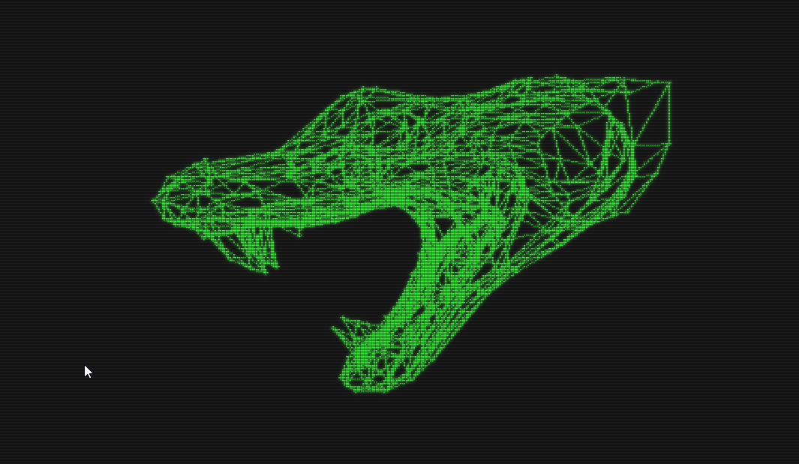

# 🦀 CrabMusic

CrabMusic is an experimental project into the boundaries of ASCII control, utilizing a Rust framework.

Made with love by Frosty40. Build bridges not bombs.

## ✨ Current Capabilities

- 🟣 Unicode Braille engine for ultra‑fine ASCII art (2×4 dots per cell)
- 🌈 Color modes: Off → Grayscale → Full RGB
- � Multiple character sets for audio visuals (7 styles)
- �🖼️ Image viewer: `--image <file>` or drag/paste with `--image-drop`
- 🔁 Two‑image morph (crossfade, ping‑pong loop): `--morph-a <A>` `--morph-b <B>` `[--morph-duration ms]`
- �️ Live image controls: `[ / ]` speed, `r` reverse, `Space` pause, `l` letterbox, `c` color, `+/-` threshold, `a` auto‑threshold, `x` maximize, `s` save
- 💾 Save Braille art to text: writes `<image_stem>.braille.txt`
- 📐 Smart fit: letterbox ON/OFF, live terminal resize handling, optional canvas maximize `x`
- 🎞️ Video playback: `--video <file>` (feature‑gated)
- 🎵 Audio visualization: microphone and Windows WASAPI loopback capture
- 🔊 Audio output (hear while visualizing) and device selection for input/output
- ⚙️ Configurable via YAML with hot‑reload
- ⚡ High‑performance Rust renderer with differential updates
- 🖥️ Cross‑platform (Windows, macOS, Linux)
- 🧊 3D OBJ Viewer: true edge/vertex wireframe with hidden-line removal, simple solid shading, zoom/focus, and multi‑axis rotation controls


## 🎨 Gallery

### Braille Art Output

<p align="center">
  
  
</p>

<p align="center">
  
  
</p>

### Different Rendering Modes

<p align="center">
  
  
  
</p>

### Audio Visualization & Effects

<p align="center">
  
  
</p>

<p align="center">
  
  
</p>


### 3D OBJ Viewer (Wireframe & Solid)

<p align="center">
  
  
  
</p>

## 🚀 Quick Start

### Installation

```bash
# Clone the repository
git clone https://github.com/newjordan/crabmusic.git
cd crabmusic

# Build the project
cargo build --release

# Run with default settings (microphone input)
cargo run --release
```

### Quick Start: Images

```bash
# Open a single image (Braille art)
cargo run --release -- --image ".\media\viper.jpg"

# Start a morph that ping‑pongs between two images (A↔B)
cargo run --release -- --morph-a ".\media\viper.jpg" --morph-b ".\media\tiger.jpg"

# Optional: set morph duration per leg (ms)
cargo run --release -- --morph-a ".\media\viper.jpg" --morph-b ".\media\tiger.jpg" --morph-duration 4000

# Drag-and-paste mode: start, then paste paths to view
cargo run --release -- --image-drop
```

### Quick Start: Audio

```bash
# Windows system audio (WASAPI loopback)
cargo run --release -- --loopback

# Mic input, pick devices
cargo run --release -- --device "Microphone" --output-device "Speakers"
```

### Quick Start: Video (feature-gated)

```bash
# Play a video file as Braille
cargo run --release -- --video ".\media\clip.mp4"

cargo run --release --features video -- --video "media/clip.mp4"

```

### Quick Start: 3D OBJ Viewer

- Put your `.obj` files in the `models/` folder (we ignore `.mtl`).
- Run the app (`cargo run`) and switch to the “OBJ Viewer” channel (use ←/→ to change channels; the status bar lists keys).
- Use Up/Down to switch between OBJ files.

Controls (OBJ Viewer):
- W: toggle Wireframe/Solid
- A/D: yaw left/right
- J/K: pitch down/up
- ,/.: roll CCW/CW
- Z/X: zoom in/out
- F: focus (fit to view)
- G/H: line thickness (wireframe)
- T/Y: vertex dot size (wireframe)
- R: auto‑rotate ON/OFF

Notes:
- Wireframe rendering shows real mesh edges and vertices with hidden‑line removal (depth‑tested) so back/occluded edges don’t clutter.
- Solid mode uses simple diffuse lighting; if normals are missing in the OBJ, we fall back to flat shading safely.
- OBJ loader supports 1‑based and negative indices and triangulates n‑gons by fan. Texture/MTL are ignored for now.


### More

```bash
# List audio devices
cargo run --release -- --list-devices

# Show all options
cargo run --release -- --help
```

## ⌨️ Image Mode Controls

- `m` - start/stop morph (prompt for second image when starting from single image)
- `Space` - pause/unpause morph
- `r` - reverse morph direction instantly
- `[` / `]` - faster / slower (shorter/longer duration per leg)
- `l` - letterbox ON/OFF (preserve aspect vs fill)
- `c` - color mode: Off → Grayscale → Full RGB
- `+` / `-` - manual threshold up/down; `a` - toggle auto-threshold
- `x` - attempt to maximize canvas (some terminals may not allow programmatic resize)
- `s` - save current Braille art to `<image_stem>.braille.txt` next to the image
- `Esc` - clears typed input/morph prompt; `Esc` again (empty) quits; `q` also quits

## 📝 Configuration

CrabMusic uses YAML configuration files. The default configuration is loaded from `config.default.yaml`.

Key configuration options:
- Audio sample rate and buffer sizes
- DSP processing parameters (FFT size, smoothing, frequency ranges)
- Visualization settings (amplitude scale, frequency scale, wave count)
- Character set selection
- Target FPS

See `config.default.yaml` for all available options and detailed comments.

## 🛠️ Development

### Prerequisites

- Rust 1.75 or later
- System audio libraries:
  - **Linux**: ALSA development files (`libasound2-dev` on Debian/Ubuntu)
  - **macOS**: CoreAudio (included with Xcode Command Line Tools)
  - **Windows**: WASAPI (included with Windows)

#### macOS Setup

On macOS, you'll need Xcode Command Line Tools installed:

```bash
xcode-select --install
```

**Audio Device Access**: macOS may prompt for microphone permissions on first run. Grant access in System Preferences → Security & Privacy → Privacy → Microphone.

**Terminal Compatibility**: Best performance with:
- iTerm2 (recommended for Unicode Braille support)
- Terminal.app (built-in, works well)
- Alacritty, kitty (modern GPU-accelerated terminals)

### Building

```bash
# Debug build
cargo build

# Release build (optimized)
cargo build --release

# Run tests
cargo test

# Run benchmarks
cargo bench

# Check code quality
cargo clippy
cargo fmt
```

### Platform-Specific Testing

**Visual Test Suite** (Unix/macOS/Linux):
```bash
# Run the sacred geometry visual test suite
./test-sacred-geometry.sh
```

**Visual Test Suite** (Windows):
```powershell
# Run the sacred geometry visual test suite
.\test-sacred-geometry.ps1
```

Both scripts run interactive demos for manual visual verification of rendering quality.

### Project Structure

```
crabmusic/
├── src/
│   ├── main.rs              # Application entry point
│   ├── audio/               # Audio capture and playback
│   │   ├── cpal_device.rs   # CPAL-based audio capture
│   │   ├── wasapi_loopback.rs  # Windows WASAPI loopback (system audio)
│   │   ├── output_device.rs # Audio output/passthrough
│   │   └── ring_buffer.rs   # Lock-free ring buffer
│   ├── dsp/                 # DSP processing (FFT, frequency analysis)
│   ├── visualization/       # Visualization engine
│   │   ├── sine_wave.rs     # Sine wave visualizer
│   │   └── character_sets.rs # ASCII/Unicode character sets
│   ├── rendering/           # Terminal rendering with differential updates
│   └── config/              # Configuration management
├── tests/                   # Integration tests
├── benches/                 # Performance benchmarks
└── config.default.yaml      # Default configuration
```

## 🏗️ Architecture

CrabMusic uses a pipeline architecture with lock-free ring buffers for thread communication:

```
┌─────────────────┐
│  Audio Capture  │ (CPAL or WASAPI)
│   (Thread 1)    │
└────────┬────────┘
         │ Ring Buffer
         ▼
┌─────────────────┐
│ DSP Processing  │ (FFT, Frequency Analysis)
│   (Main Loop)   │
└────────┬────────┘
         │
         ▼
┌─────────────────┐
│  Visualization  │ (Sine Wave, Character Mapping)
│   (Main Loop)   │
└────────┬────────┘
         │
         ▼
┌─────────────────┐
│    Rendering    │ (Differential Terminal Updates)
│   (Main Loop)   │
└─────────────────┘
```

**Key Design Decisions:**
- **Lock-free ring buffer** for audio data transfer between threads
- **Trait-based audio devices** for polymorphic capture (CPAL vs WASAPI)
- **Differential rendering** to minimize terminal I/O
- **Hot-reload configuration** for live parameter tuning

## 🤝 Contributing

Contributions are welcome! Areas for improvement:
- Additional visualizer modes (spectrum analyzer, oscilloscope, waveform)
- Color support and themes
- Beat detection and rhythm analysis
- More character sets and visual effects
- Performance optimizations

## 📄 License

MIT License - see LICENSE file for details

## 🙏 Acknowledgments

Built with these excellent Rust crates:
- [cpal](https://github.com/RustAudio/cpal) - Cross-platform audio I/O
- [wasapi](https://github.com/HEnquist/wasapi-rs) - Windows WASAPI bindings
- [rustfft](https://github.com/ejmahler/RustFFT) - Fast Fourier Transform
- [spectrum-analyzer](https://github.com/phip1611/spectrum-analyzer) - Frequency analysis
- [ratatui](https://github.com/ratatui-org/ratatui) - Terminal UI framework
- [crossterm](https://github.com/crossterm-rs/crossterm) - Terminal manipulation

---

## 📊 Current Status

**Version**: 0.1.0

**Implemented:**
- ✅ Unicode Braille renderer with full RGB color mode (Off → Grayscale → Full)
- ✅ Image viewer: `--image`, drag/paste with `--image-drop`
- ✅ Two-image morph (crossfade, ping‑pong): `--morph-a`, `--morph-b`, optional `--morph-duration`
- ✅ Live controls: `[ / ]` speed, `r` reverse, `Space` pause, `l` letterbox, `c` color, `+/-` threshold, `a` auto-threshold, `x` maximize, `s` save
- ✅ Live terminal-resize handling
- ✅ Save Braille art to `<stem>.braille.txt`
- ✅ Audio capture (mic + Windows WASAPI loopback) and audio output
- ✅ Differential terminal updates + YAML config with hot‑reload
- ✅ Video playback entrypoint (`--video`, feature‑gated)
- ✅ 3D OBJ Viewer channel: real mesh wireframe (hidden‑line removal), simple solid shading, zoom/focus, multi‑axis rotation; place .obj files in `models/` and use Up/Down to switch. Keys: W mode, A/D yaw, J/K pitch, ,/. roll, Z/X zoom, F focus, G/H line, T/Y dot, R auto‑rotate.


**Next up (roadmap):**
- 🔁 Image playlists (3+ images) with selectable transitions
- ✨ Additional transitions (noise dissolve, wipe/slide, radial)
- 📊 Simpler, accurate spectrum analyzer (Spectrum 2) and beat‑reactive effects
- 🧭 XY oscilloscope refinements

