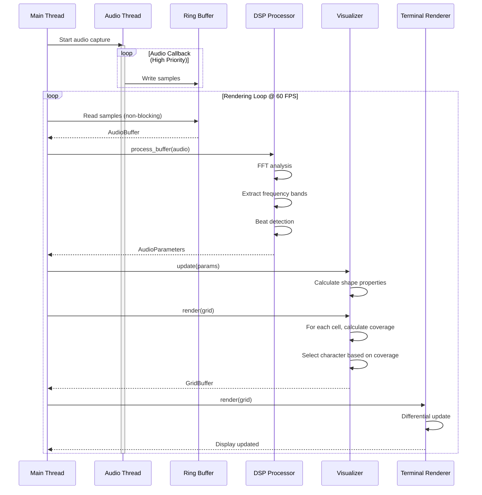
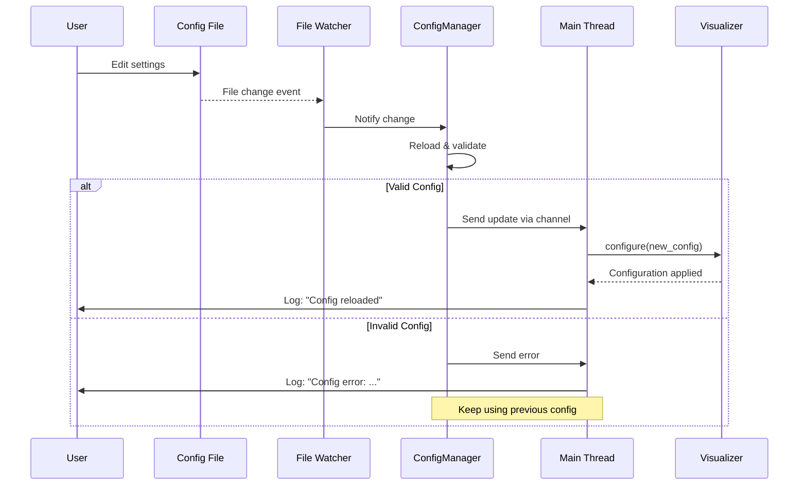

# CrabMusic Architecture Document

## Introduction

This document outlines the architecture for **crabmusic**, a real-time ASCII music visualizer that renders audio-reactive visualizations in the terminal. The system captures system audio output, processes it through FFT analysis, and renders dynamic ASCII art synchronized to music playback.

### Project Overview

**crabmusic** is a standalone terminal application that:
- Captures system audio output in real-time (no music player integration required)
- Performs DSP analysis (FFT, frequency band isolation, beat detection)
- Renders audio-reactive ASCII visualizations using a grid-based character coverage system
- Supports multiple visualization modes (starting with sine wave MVP, expanding to spectrum analyzers, oscilloscope patterns, and sacred geometry)
- Provides configurable audio-to-visual mappings with hot-reload capability

### Architecture Goals

1. **Real-time Performance**: Sub-16ms frame times for smooth 60 FPS rendering
2. **Low Latency Audio**: Minimal delay between audio input and visual response
3. **Modular Design**: Composable visual elements and effects
4. **Cross-Platform**: Support Linux, macOS, and Windows
5. **Developer Experience**: Clear separation of concerns, testable components

### Change Log

| Date | Version | Description | Author |
|------|---------|-------------|--------|
| 2025-10-29 | 1.0 | Initial architecture document | Winston (Architect) |

---

## High Level Architecture

### Technical Summary

**crabmusic** is a **single-binary, real-time processing application** written in Rust. The architecture follows a **pipeline pattern** with three primary stages: audio capture → DSP processing → terminal rendering. The system uses an **event-driven rendering loop** that processes audio buffers continuously, extracting parameters through FFT analysis, and updating a grid-based visualization buffer that determines character selection per terminal cell. The architecture emphasizes **zero-copy operations** where possible and leverages Rust's ownership system for memory safety in concurrent audio/rendering threads.

### High Level Overview

**Architectural Style**: Monolithic Binary with Pipeline Architecture

The system is organized as a single executable with clear internal module boundaries:

1. **Audio Capture Module**: Taps system audio output stream using platform-specific APIs (ALSA/PulseAudio/PipeWire on Linux, CoreAudio on macOS, WASAPI on Windows)

2. **DSP Processing Module**: Performs FFT analysis, frequency band isolation (bass, low-mid, mid, high-mid, treble), beat detection, and spectral analysis on captured audio buffers

3. **Visualization Engine**: Translates audio parameters into visual element properties, calculates grid cell coverage, and selects optimal characters for smooth rendering

4. **Terminal Renderer**: Manages terminal state, double-buffering, and efficient character updates using crossterm

5. **Configuration System**: Loads settings from YAML/TOML files with hot-reload capability for live parameter tuning

**Data Flow**:
```
System Audio Output → Audio Capture → Ring Buffer → FFT/DSP → Audio Parameters →
Visualization Engine → Grid Buffer → Terminal Renderer → Display
```

**Key Architectural Decisions**:

- **Single Binary**: Terminal applications don't benefit from microservices overhead; monolithic design simplifies deployment and reduces latency
- **Rust Language**: Zero-cost abstractions, no GC pauses, memory safety, and excellent audio/terminal library ecosystem
- **Pipeline Pattern**: Clear stages with well-defined interfaces enable testing and future visualization additions
- **Grid-Based Rendering**: Each cell calculates its character based on mathematical shapes rather than moving elements - enables any pattern including future video playback
- **Lock-Free Ring Buffer**: Audio thread writes to ring buffer, rendering thread reads - prevents audio dropouts from rendering delays

### High Level Project Diagram

```mermaid
graph TB
    subgraph System["System Environment"]
        Audio["System Audio Output<br/>(Speaker/Headphones)"]
    end

    subgraph CrabMusic["CrabMusic Application"]
        Capture["Audio Capture<br/>(CPAL/Platform APIs)"]
        RingBuf["Lock-Free<br/>Ring Buffer"]
        DSP["DSP Processing<br/>(RustFFT)"]
        Params["Audio Parameters<br/>(Bands, Beats, Spectrum)"]
        VizEngine["Visualization Engine<br/>(Shape Generators)"]
        Grid["Grid Buffer<br/>(Character Coverage)"]
        Renderer["Terminal Renderer<br/>(Ratatui/Crossterm)"]
        Config["Configuration<br/>(Settings, Mappings)"]
    end

    subgraph Terminal["Terminal Display"]
        Display["ASCII Visualization"]
    end

    Audio -->|Capture Stream| Capture
    Capture -->|Audio Samples| RingBuf
    RingBuf -->|Buffer Read| DSP
    DSP -->|FFT Results| Params
    Params -->|Drive| VizEngine
    Config -.->|Configure| VizEngine
    Config -.->|Mappings| Params
    VizEngine -->|Update| Grid
    Grid -->|Characters| Renderer
    Renderer -->|Render| Display

    style CrabMusic fill:#2d2d2d,stroke:#569cd6,stroke-width:2px
    style System fill:#1e1e1e,stroke:#666,stroke-width:1px
    style Terminal fill:#1e1e1e,stroke:#666,stroke-width:1px
```



### Architectural and Design Patterns

- **Pipeline Pattern**: Audio → DSP → Visualization → Rendering stages with clear interfaces - _Rationale:_ Enables independent testing, optimization, and future extension of each stage without affecting others

- **Producer-Consumer with Ring Buffer**: Audio capture thread produces samples, rendering thread consumes - _Rationale:_ Lock-free ring buffer prevents audio thread blocking, critical for avoiding audio dropouts and maintaining real-time performance

- **Strategy Pattern for Visualizations**: Pluggable visualization modes implementing common `Visualizer` trait - _Rationale:_ Enables MVP with sine wave, then seamless addition of spectrum analyzers, oscilloscope, sacred geometry without architecture changes

- **Double Buffering**: Grid buffer is updated off-screen, then swapped for rendering - _Rationale:_ Prevents screen tearing and allows complex calculations without visible artifacts

- **Configuration-Driven Behavior**: Audio-to-visual mappings defined in config files - _Rationale:_ Enables users to experiment with mappings without recompilation, supports preset sharing

- **Trait-Based Polymorphism**: `AudioCaptureDevice`, `Visualizer`, `CharacterSet` traits - _Rationale:_ Rust idiom for abstraction without runtime overhead, enables mocking for tests

---

## Tech Stack

### Technology Selection Rationale

Based on project requirements analysis and ecosystem research, the following technology stack has been selected to prioritize **real-time performance**, **memory safety**, **cross-platform compatibility**, and **developer productivity**.

### Technology Stack Table

| Category | Technology | Version | Purpose | Rationale |
|----------|------------|---------|---------|-----------|
| **Language** | Rust | 1.75+ | Primary development language | Zero-cost abstractions, no GC pauses (critical for real-time audio), memory safety, excellent async support, strong audio/terminal ecosystem |
| **Audio Capture** | cpal | 0.15+ | Cross-platform audio I/O | Pure Rust, supports ALSA/PulseAudio/JACK/PipeWire (Linux), CoreAudio (macOS), WASAPI (Windows) |
| **FFT Processing** | rustfft | 6.1+ | Fast Fourier Transform | High-performance pure Rust FFT, widely used, well-optimized for audio processing |
| **Audio Analysis** | spectrum-analyzer | 1.0+ | Frequency spectrum extraction | Built on rustfft, provides frequency spectrum for audio with minimal code |
| **Terminal UI** | ratatui | 0.26+ | Terminal user interface framework | Modern fork of tui-rs, active development, widget-based UI, excellent for complex layouts |
| **Terminal Backend** | crossterm | 0.27+ | Low-level terminal manipulation | Cross-platform, default backend for ratatui, handles cursor, colors, input |
| **Configuration** | serde + serde_yaml | 1.0+ / 0.9+ | Settings serialization | De-facto standard for Rust config, human-readable YAML format |
| **Async Runtime** | tokio | 1.35+ (optional) | Async I/O for config hot-reload | Industry standard, enables file watching and async event handling if needed |
| **CLI Arguments** | clap | 4.5+ | Command-line argument parsing | Derive macros for ergonomic CLI, auto-generated help, validation |
| **Error Handling** | anyhow + thiserror | 1.0+ / 1.0+ | Error management | anyhow for applications, thiserror for library-style errors, ergonomic error propagation |
| **Logging** | tracing + tracing-subscriber | 0.1+ | Structured logging and diagnostics | Better than log crate for performance tracing, structured events, production debugging |
| **Build System** | cargo | (bundled with Rust) | Build, test, dependency management | Standard Rust toolchain, excellent dependency resolution |
| **Testing** | cargo test + criterion | (bundled) + 0.5+ | Unit/integration tests + benchmarks | Built-in test framework, criterion for performance benchmarking of DSP code |

### Additional Development Tools

| Tool | Purpose |
|------|---------|
| **rustfmt** | Code formatting (enforced in CI) |
| **clippy** | Linting and best practices |
| **cargo-watch** | Auto-rebuild on file changes during development |
| **cargo-criterion** | Benchmark runner for performance testing |

### Platform-Specific Considerations

**Linux**:
- Primary audio: CPAL with PipeWire support (modern default)
- Fallback: ALSA direct for lower latency on older systems
- Terminal: All major emulators supported (alacritty, kitty, gnome-terminal, konsole)

**macOS**:
- Audio: CPAL with CoreAudio backend
- Terminal: iTerm2, Terminal.app, alacritty

**Windows**:
- Audio: CPAL with WASAPI backend
- Terminal: Windows Terminal, alacritty (note: older terminals may have poor Unicode support)

---

## Data Models

### Audio Buffer

**Purpose**: Represents captured audio samples from system output

**Key Attributes**:
- `samples: Vec<f32>` - Raw audio sample data (32-bit float for DSP precision)
- `sample_rate: u32` - Sampling rate in Hz (typically 44100 or 48000)
- `channels: u16` - Number of audio channels (mono=1, stereo=2)
- `timestamp: Instant` - Capture timestamp for latency tracking

**Relationships**:
- Consumed by DSP module for FFT processing
- Produced by AudioCaptureDevice implementations

---

### Audio Parameters

**Purpose**: Extracted audio features driving visualization

**Key Attributes**:
- `bass: f32` - Bass frequency band energy (20-250 Hz)
- `low_mid: f32` - Low-mid frequency energy (250-500 Hz)
- `mid: f32` - Mid frequency energy (500-2000 Hz)
- `high_mid: f32` - High-mid frequency energy (2000-6000 Hz)
- `treble: f32` - Treble frequency energy (6000-20000 Hz)
- `overall_amplitude: f32` - RMS amplitude of entire signal
- `beat_detected: bool` - Beat onset detection flag
- `spectral_centroid: f32` - "Brightness" of sound
- `spectrum: Vec<f32>` - Full frequency spectrum for advanced visualizations

**Relationships**:
- Produced by DSP module from AudioBuffer
- Consumed by Visualizer implementations to drive visual properties

---

### Grid Cell

**Purpose**: Single cell in terminal grid determining character display

**Key Attributes**:
- `position: (u16, u16)` - (x, y) coordinates in terminal
- `coverage: f32` - Percentage of cell covered by shape (0.0-1.0)
- `character: char` - Selected character based on coverage
- `color: Option<Color>` - Optional color if terminal supports it

**Relationships**:
- Part of GridBuffer array
- Calculated by ShapeRenderer based on mathematical functions

---

### Visualization Config

**Purpose**: User-configurable settings for audio-visual mappings

**Key Attributes**:
- `mode: VisualizerMode` - Active visualization (SineWave, SpectrumAnalyzer, etc.)
- `sensitivity: HashMap<String, f32>` - Gain per audio parameter
- `grid_width: u16` - Terminal width in characters
- `grid_height: u16` - Terminal height in characters
- `character_set: CharacterSet` - Selected character palette
- `refresh_rate: u32` - Target FPS (default 60)
- `smoothing: f32` - Parameter smoothing factor (0.0-1.0)

**Relationships**:
- Loaded from YAML config file
- Hot-reloadable during runtime
- Drives behavior of VisualizationEngine

---

## Components

### Audio Capture Component

**Responsibility**: Interface with system audio APIs to capture real-time audio output stream

**Key Interfaces**:
- `AudioCaptureDevice` trait:
  - `fn start_capture(&mut self) -> Result<()>` - Begin capturing audio
  - `fn stop_capture(&mut self) -> Result<()>` - Stop audio capture
  - `fn read_samples(&mut self) -> Option<AudioBuffer>` - Non-blocking sample read
  - `fn get_config(&self) -> AudioConfig` - Get sample rate, channels, etc.

**Dependencies**:
- `cpal` crate for cross-platform audio I/O
- Platform-specific audio APIs (ALSA, PipeWire, CoreAudio, WASAPI)

**Technology Stack**:
- Rust with `cpal` 0.15+
- Lock-free ring buffer (possibly `ringbuf` crate) for passing samples to DSP thread
- Callback-based audio stream processing

**Implementation Notes**:
- Audio capture runs on dedicated high-priority thread
- Minimum possible buffer sizes to reduce latency
- Graceful handling of audio device disconnection/reconnection
- Platform-specific optimizations where beneficial

---

### DSP Processing Component

**Responsibility**: Transform raw audio samples into meaningful parameters for visualization

**Key Interfaces**:
- `DspProcessor` struct:
  - `fn process_buffer(&mut self, buffer: &AudioBuffer) -> AudioParameters` - Main processing function
  - `fn set_window_size(&mut self, size: usize)` - Configure FFT window size
  - `fn set_smoothing(&mut self, factor: f32)` - Set parameter smoothing

**Dependencies**:
- `rustfft` for FFT computation
- `spectrum-analyzer` for frequency band extraction
- AudioBuffer from capture component

**Technology Stack**:
- `rustfft` 6.1+ with planner for optimized FFT
- `spectrum-analyzer` 1.0+ for audio-specific frequency analysis
- Custom bandpass filters for frequency band isolation
- Beat detection using spectral flux algorithm

**Implementation Notes**:
- Window size: 2048-4096 samples (balance between frequency resolution and latency)
- Hann windowing function to reduce spectral leakage
- Smoothing applied to prevent jittery visualizations
- Pre-computed FFT plans for performance

---

### Visualization Engine Component

**Responsibility**: Translate audio parameters into visual representations on character grid

**Key Interfaces**:
- `Visualizer` trait:
  - `fn update(&mut self, params: &AudioParameters)` - Update internal state
  - `fn render(&self, grid: &mut GridBuffer)` - Render to grid
  - `fn configure(&mut self, config: &VisualizerConfig)` - Apply configuration

- Implementations:
  - `SineWaveVisualizer` - MVP: sine wave with audio-reactive thickness/amplitude
  - `SpectrumAnalyzerVisualizer` - Frequency bars (future)
  - `OscilloscopeVisualizer` - Circles, spirals, lissajous (future)
  - `SacredGeometryVisualizer` - Flower of life, mandalas (future)

**Dependencies**:
- AudioParameters from DSP component
- GridBuffer for rendering
- Configuration system

**Technology Stack**:
- Pure Rust mathematical shape generation
- Trait-based polymorphism for multiple visualizer types
- Shape rendering using mathematical functions (sine, parametric curves)
- Character coverage algorithm: calculates overlap percentage per grid cell

**Implementation Notes**:
- Grid cells are stateless - recalculated each frame
- Coverage thresholds determine character selection (e.g., 0-25% = ' ', 25-50% = '░', 50-75% = '▒', 75-100% = '▓')
- Modular design: new visualizers just implement `Visualizer` trait
- MVP starts with `SineWaveVisualizer` to prove engine

---

### Terminal Renderer Component

**Responsibility**: Efficiently update terminal display with minimal flicker and optimal performance

**Key Interfaces**:
- `TerminalRenderer` struct:
  - `fn init() -> Result<Self>` - Initialize terminal (enter raw mode, alt screen)
  - `fn render(&mut self, grid: &GridBuffer)` - Update display with new grid
  - `fn cleanup(&mut self)` - Restore terminal state
  - `fn get_dimensions(&self) -> (u16, u16)` - Get terminal size

**Dependencies**:
- `ratatui` for high-level TUI abstractions
- `crossterm` for low-level terminal control
- GridBuffer from visualization engine

**Technology Stack**:
- `ratatui` 0.26+ with `crossterm` backend
- Double-buffering built into ratatui
- Differential rendering (only update changed cells)

**Implementation Notes**:
- Enter alternate screen (preserves user's terminal session)
- Raw mode for immediate input handling (future interactive features)
- Handle terminal resize events gracefully
- Target 60 FPS but degrade gracefully if terminal is slow
- Efficient cursor positioning using crossterm

---

### Configuration Component

**Responsibility**: Load, validate, and hot-reload user configuration settings

**Key Interfaces**:
- `ConfigManager` struct:
  - `fn load(path: &Path) -> Result<AppConfig>` - Load config from file
  - `fn watch(&mut self) -> ConfigUpdateReceiver` - Enable hot-reload (returns channel)
  - `fn validate(&self, config: &AppConfig) -> Result<()>` - Validate settings

**Dependencies**:
- `serde` + `serde_yaml` for serialization
- Optional: `notify` crate for file watching
- Optional: `tokio` for async file watching

**Technology Stack**:
- YAML format for human-readable config files
- Serde derive macros for automatic serialization
- File watcher for hot-reload capability (nice-to-have for MVP)

**Configuration Structure** (YAML example):
```yaml
audio:
  sample_rate: 48000
  buffer_size: 1024

visualization:
  mode: sine_wave
  grid:
    width: auto  # Use terminal size
    height: auto
  refresh_rate: 60

mappings:
  sine_wave:
    amplitude:
      driver: overall_amplitude
      sensitivity: 2.0
      smoothing: 0.3
    frequency:
      driver: bass
      sensitivity: 1.5
    thickness:
      driver: mid
      min: 1
      max: 5

character_set: block_elements  # Options: ascii, block_elements, box_drawing
```

---

## Core Workflows

### Primary Rendering Loop Workflow



### Configuration Hot-Reload Workflow



---

## Source Tree

```
crabmusic/
├── Cargo.toml                       # Project dependencies and metadata
├── Cargo.lock                       # Dependency lockfile
├── README.md                        # Project documentation
├── LICENSE                          # License file
│
├── config/                          # Configuration files
│   ├── default.yaml                # Default configuration
│   └── examples/                   # Example configs for different styles
│       ├── minimal.yaml
│       ├── bass_heavy.yaml
│       └── spectrum.yaml
│
├── docs/                            # Documentation
│   ├── architecture.md             # This document
│   ├── brainstorming-session-results.md
│   └── development.md              # Development guide (TBD)
│
├── src/
│   ├── main.rs                     # Application entry point, CLI setup, main loop
│   │
│   ├── audio/                      # Audio capture module
│   │   ├── mod.rs                  # Module definitions and traits
│   │   ├── capture.rs              # AudioCaptureDevice trait and implementations
│   │   ├── buffer.rs               # AudioBuffer struct
│   │   └── platform/               # Platform-specific implementations
│   │       ├── cpal_device.rs      # CPAL-based cross-platform implementation
│   │       └── mod.rs
│   │
│   ├── dsp/                        # DSP processing module
│   │   ├── mod.rs                  # DSP module interface
│   │   ├── processor.rs            # DspProcessor main implementation
│   │   ├── fft.rs                  # FFT processing logic
│   │   ├── frequency_bands.rs      # Frequency band extraction
│   │   ├── beat_detection.rs       # Beat onset detection
│   │   └── parameters.rs           # AudioParameters struct
│   │
│   ├── visualization/              # Visualization engine module
│   │   ├── mod.rs                  # Visualizer trait and engine
│   │   ├── grid.rs                 # GridBuffer and GridCell structs
│   │   ├── character_sets.rs       # Character set definitions
│   │   ├── coverage.rs             # Character coverage calculation
│   │   └── visualizers/            # Individual visualizer implementations
│   │       ├── mod.rs
│   │       ├── sine_wave.rs        # MVP sine wave visualizer
│   │       ├── spectrum.rs         # Spectrum analyzer (future)
│   │       └── oscilloscope.rs     # Oscilloscope modes (future)
│   │
│   ├── rendering/                  # Terminal rendering module
│   │   ├── mod.rs                  # TerminalRenderer interface
│   │   ├── renderer.rs             # Main renderer implementation
│   │   └── colors.rs               # Color management (future)
│   │
│   ├── config/                     # Configuration module
│   │   ├── mod.rs                  # ConfigManager and AppConfig
│   │   ├── loader.rs               # Config file loading
│   │   ├── validator.rs            # Config validation
│   │   └── watcher.rs              # Hot-reload file watching
│   │
│   └── error.rs                    # Error types and handling
│
├── tests/                          # Integration tests
│   ├── audio_capture_test.rs       # Test audio capture with mock data
│   ├── dsp_processor_test.rs       # Test FFT and parameter extraction
│   └── visualizer_test.rs          # Test visualization rendering
│
└── benches/                        # Performance benchmarks
    ├── fft_benchmark.rs            # FFT performance benchmarks
    └── render_benchmark.rs         # Rendering performance benchmarks
```

### Key Directory Explanations

**`src/audio/`**: Handles all audio input responsibilities. Abstracts platform differences behind `AudioCaptureDevice` trait. CPAL handles most cross-platform concerns, but structure allows platform-specific optimizations if needed.

**`src/dsp/`**: Self-contained DSP processing. No dependencies on other modules except `audio` types. Can be tested independently with synthetic audio data.

**`src/visualization/`**: Core visualization engine. The `visualizers/` subdirectory contains individual visualizer implementations. MVP includes only `sine_wave.rs`; others added progressively.

**`src/rendering/`**: Terminal-specific code isolated here. Uses ratatui/crossterm for actual terminal operations. Keeps terminal concerns separate from visualization logic.

**`config/`**: User-facing configuration files. `default.yaml` provides sensible defaults. Examples demonstrate different use cases.

---

## Infrastructure and Deployment

### Infrastructure as Code

**Tool**: N/A - Not applicable for desktop application

**Deployment**: Single binary distribution

**Approach**: Pre-compiled binaries for major platforms (Linux x86_64, macOS ARM64/x86_64, Windows x86_64)

---

### Build and Release Strategy

**Build Process**:
- `cargo build --release` for optimized binary
- Profile-guided optimization (PGO) for maximum performance (optional)
- Strip debug symbols to reduce binary size
- Cross-compilation using `cross` tool for different platforms

**Binary Distribution**:
- GitHub Releases with pre-built binaries
- Package managers (future):
  - Linux: AUR (Arch), PPA (Ubuntu), RPM (Fedora)
  - macOS: Homebrew formula
  - Windows: Scoop, Chocolatey
  - Cross-platform: cargo install crabmusic

**CI/CD Platform**: GitHub Actions

**Pipeline Configuration**: `.github/workflows/ci.yml`

Pipeline stages:
1. **Lint & Format**: Run clippy and rustfmt checks
2. **Test**: Run unit tests and integration tests on Linux/macOS/Windows
3. **Benchmark**: Run criterion benchmarks and compare to baseline (on main branch only)
4. **Build**: Compile release binaries for all platforms
5. **Release**: On tagged commits, create GitHub release with binaries

---

### Environments

**Development**: Local developer machines
- Debug builds with `RUST_LOG=debug` for verbose logging
- Hot-reload config for fast iteration
- Test audio files for reproducible testing

**Production**: End-user machines
- Release builds (optimized, stripped)
- Minimal logging (warn/error only)
- Graceful error handling and recovery

---

### Performance Optimization

**Compilation**:
```toml
[profile.release]
opt-level = 3           # Maximum optimization
lto = "fat"             # Link-time optimization
codegen-units = 1       # Single codegen unit for better optimization
strip = true            # Strip symbols
panic = "abort"         # Smaller binary, faster panic
```

**Runtime**:
- Audio thread priority elevated where platform allows
- FFT plans computed once and reused
- Grid buffer pre-allocated to terminal size
- Lock-free data structures for inter-thread communication

---

## Error Handling Strategy

### General Approach

**Error Model**: Rust's `Result<T, E>` type with custom error types

**Exception Hierarchy**:
```rust
pub enum CrabMusicError {
    AudioCapture(AudioError),
    DspProcessing(DspError),
    Rendering(RenderError),
    Configuration(ConfigError),
    Io(std::io::Error),
}
```

**Error Propagation**:
- Use `?` operator for ergonomic error propagation
- `anyhow::Result` in application code (main.rs) for ergonomic error handling
- `thiserror` derive for library-style errors in modules
- Graceful degradation where possible (e.g., continue with default config if reload fails)

---

### Logging Standards

**Library**: `tracing` + `tracing-subscriber` 0.1+

**Format**: Structured JSON in production, human-readable in development

**Levels**:
- `ERROR`: Critical failures requiring user attention (audio device unavailable, config invalid)
- `WARN`: Recoverable issues (audio buffer underrun, frame drop)
- `INFO`: High-level lifecycle events (startup, config reload, mode change)
- `DEBUG`: Detailed operational info (FFT window size, parameter values)
- `TRACE`: Per-frame details (use sparingly, performance impact)

**Required Context**:
- Thread name for concurrent operations
- Module path for error source tracing
- Timestamp with microsecond precision

**Environment Variable**: `RUST_LOG=crabmusic=info` (default), `RUST_LOG=crabmusic=debug` for troubleshooting

---

### Error Handling Patterns

#### Audio Capture Errors

**Retry Policy**:
- Retry device opening 3 times with exponential backoff (100ms, 500ms, 1000ms)
- If all retries fail, exit with clear error message

**Timeout Configuration**: 5-second timeout for device initialization

**Error Translation**:
```rust
AudioError::DeviceNotAvailable => "No audio capture device found. Ensure your audio system is running."
AudioError::PermissionDenied => "Permission denied. On Linux, ensure your user is in the 'audio' group."
```

#### DSP Processing Errors

**Handling**:
- Invalid buffer sizes: Log warning, skip frame
- FFT computation failures: Should never happen with valid input, log error and use zero parameters
- NaN/Infinity in results: Clamp to valid range, log warning

#### Configuration Errors

**Validation**:
- Parse errors: Show exact line/column from serde
- Invalid values: Clear message about valid ranges (e.g., "refresh_rate must be 1-120")
- On reload failure: Keep using previous valid config, log error

**User-Facing Errors**:
```
Error loading config from 'config.yaml':
  Line 15: Unknown field 'visualisations' (did you mean 'visualization'?)
```

---

## Coding Standards

### Core Standards

**Language & Runtime**: Rust 1.75+ (stable channel)

**Style & Linting**:
- Enforce with `rustfmt` (use default style)
- Enforce with `clippy::all` + `clippy::pedantic` (exceptions documented in `Cargo.toml`)
- Run in CI - builds fail if checks don't pass

**Test Organization**:
- Unit tests: `#[cfg(test)] mod tests { ... }` at bottom of each file
- Integration tests: `tests/` directory
- Benchmarks: `benches/` directory using `criterion`

---

### Critical Rules

- **No panics in library code**: All fallible operations must return `Result`. Only `main.rs` may panic/unwrap after startup validation

- **No unwrap() without justification**: Use `.expect("reason")` instead to document why panic is impossible

- **All public APIs must have doc comments**: Use `cargo doc` to verify documentation

- **FFT window size must be power of 2**: Validate in config loading, not at runtime

- **Audio thread must never block**: No locks, no allocations, no I/O in audio callback

- **Grid dimensions must match terminal size**: Validate on resize, prevent buffer overruns

- **All configuration fields must have defaults**: Use `#[serde(default)]` for Optional fields

- **Floating point comparisons use epsilon**: Never use `==` for `f32`/`f64`

---

### Rust-Specific Guidelines

**Ownership & Borrowing**:
- Prefer borrowing (`&T`) over cloning unless data needs ownership
- Use `Cow<T>` for potentially borrowed/owned data in configs
- Ring buffer uses lock-free single-producer-single-consumer design

**Concurrency**:
- Audio capture runs on dedicated thread (spawned by CPAL)
- Main thread handles DSP, visualization, and rendering
- Communication via lock-free ring buffer (`ringbuf` or `crossbeam-channel`)

**Performance**:
- Pre-allocate buffers for audio and grid - no per-frame allocation
- Use `inline` hints on hot path functions (coverage calculation, character selection)
- Profile with `cargo flamegraph` before optimizing - measure, don't guess

**Safety**:
- Unsafe code requires comment justifying its necessity and soundness argument
- No unsafe code expected except in platform-specific audio code (if needed)

---

## Test Strategy and Standards

### Testing Philosophy

**Approach**: Test pyramid - many unit tests, fewer integration tests, minimal end-to-end

**Coverage Goals**:
- Core logic (DSP, visualization math): 90%+ coverage
- Audio capture/rendering: Best-effort (hardware-dependent, use mocks)

**Test Distribution**: 70% unit, 25% integration, 5% manual

---

### Test Types and Organization

#### Unit Tests

**Framework**: Built-in `#[test]` with `cargo test`

**File Convention**: Tests in `#[cfg(test)] mod tests { }` at bottom of each source file

**Location**: Same file as code being tested

**Mocking**: Manual mocking (Rust doesn't need heavy mocking libraries)

**Coverage Requirement**: 80%+ for core logic modules

**AI Agent Requirements**:
- Generate tests for all public functions
- Cover edge cases: zero amplitude, NaN inputs, boundary values
- Follow Arrange-Act-Assert pattern
- Use descriptive test names: `test_fft_with_zero_input_returns_zero_spectrum()`

**Example**:
```rust
#[cfg(test)]
mod tests {
    use super::*;

    #[test]
    fn test_character_coverage_full() {
        // Arrange
        let cell = GridCell::new(0, 0);
        let coverage = 1.0;

        // Act
        let character = cell.select_character(coverage, &CharacterSet::BlockElements);

        // Assert
        assert_eq!(character, '█');
    }
}
```

#### Integration Tests

**Scope**: Test component interaction (audio → DSP → viz pipeline)

**Location**: `tests/` directory

**Test Infrastructure**:
- **Audio**: Synthetic audio buffers (sine waves, white noise, silence)
- **Terminal**: Mock terminal backend for rendering verification
- **Config**: Test configs in `tests/fixtures/`

**Example**:
```rust
// tests/pipeline_test.rs
#[test]
fn test_audio_to_visualization_pipeline() {
    let audio_buffer = generate_sine_wave(440.0, 1.0, 44100, 2048);
    let mut dsp = DspProcessor::new(44100);
    let params = dsp.process_buffer(&audio_buffer);

    assert!(params.mid > 0.5); // 440 Hz is in mid range
    assert!(params.bass < 0.1); // Should be low for pure tone
}
```

#### End-to-End Tests

**Framework**: Manual testing with real audio

**Scope**: Visual inspection of rendering with various audio types

**Test Audio Library**:
- Pure tones (sine waves at different frequencies)
- White/pink noise
- Music samples (bass-heavy, bright, dynamic)
- Silence (validate no glitching)

**Validation**:
- Smooth visual response
- No flicker or tearing
- Correct audio-to-visual correlation
- Performance: 60 FPS sustained, no audio dropouts

---

### Test Data Management

**Strategy**: Fixtures in `tests/fixtures/` directory

**Fixtures**:
- `sine_440hz.wav` - Pure 440 Hz tone for testing
- `silence.wav` - 1 second of silence
- `test_config.yaml` - Valid test configuration

**Cleanup**: No cleanup needed - tests read-only

---

### Continuous Testing

**CI Integration**:
- `cargo test --all-features` on every PR
- `cargo bench --no-run` to ensure benchmarks compile
- Clippy and rustfmt checks
- Platform matrix: Ubuntu, macOS, Windows

**Performance Tests**: Criterion benchmarks run on main branch, results archived for regression tracking

**Security Tests**: `cargo audit` checks for vulnerable dependencies

---

## Security

### Input Validation

**Validation Approach**: Validate all external inputs (config files, CLI arguments) at application boundaries

**Validation Location**:
- CLI arguments: Validated by `clap` with derive macros
- Config files: Validated in `ConfigManager::validate()` after parsing

**Required Rules**:
- All numeric ranges checked (e.g., refresh_rate 1-120)
- File paths sanitized (no directory traversal)
- Whitelist approach for enum values (visualization modes, character sets)

---

### Secrets Management

**Development**: N/A - No secrets in this application

**Production**: N/A

**Code Requirements**:
- No API keys or tokens (standalone application)
- Config files may be user-readable (no sensitive data)

---

### Data Protection

**Encryption**: N/A - No data persistence, no network transmission

**PII Handling**: N/A - No user data collected

**Logging Restrictions**: Do not log full audio buffers (large, useless noise)

---

### Dependency Security

**Scanning Tool**: `cargo audit` (checks RustSec advisory database)

**Update Policy**:
- Security patches: Update immediately
- Minor versions: Update quarterly
- Major versions: Evaluate breaking changes before upgrading

**CI Check**: `cargo audit` runs on every PR

---

## Next Steps

### Immediate Development Tasks

1. **Set up project structure**:
   ```bash
   cargo new --bin crabmusic
   cd crabmusic
   # Add dependencies to Cargo.toml
   # Create src/ directory structure
   ```

2. **Implement MVP in this order**:
   - [ ] Audio capture with CPAL (test with audio callback logging)
   - [ ] DSP processor with basic FFT (test with synthetic sine wave)
   - [ ] Sine wave visualizer (test with static rendering)
   - [ ] Terminal renderer with ratatui (test with static grid)
   - [ ] Integrate full pipeline (audio → DSP → viz → render)
   - [ ] Configuration system (start with hardcoded, then YAML)
   - [ ] Hot-reload capability

3. **Testing & Validation**:
   - Run with various music types
   - Profile performance (should sustain 60 FPS)
   - Test on different terminals
   - Validate cross-platform builds

4. **Documentation**:
   - User-facing README with installation and usage
   - Inline code documentation (doc comments)
   - Configuration reference

### Post-MVP Expansion

After MVP validation:
- Implement spectrum analyzer visualizer
- Add oscilloscope modes (circles, spirals)
- Explore sacred geometry visualizations
- Consider color support for advanced terminals
- Build preset system for different music genres

---

### Validation Checklist

Before considering architecture complete:

- [ ] Can you explain the data flow from audio capture to display?
- [ ] Are the module boundaries clear and justifiable?
- [ ] Can each component be tested independently?
- [ ] Is the tech stack appropriate for real-time performance requirements?
- [ ] Are error handling patterns comprehensive?
- [ ] Can the architecture support future visualization modes without major refactoring?
- [ ] Is the configuration system flexible enough for user experimentation?

---

*This architecture document serves as the definitive technical blueprint for crabmusic development. All implementation decisions should align with the patterns and technologies defined herein.*
